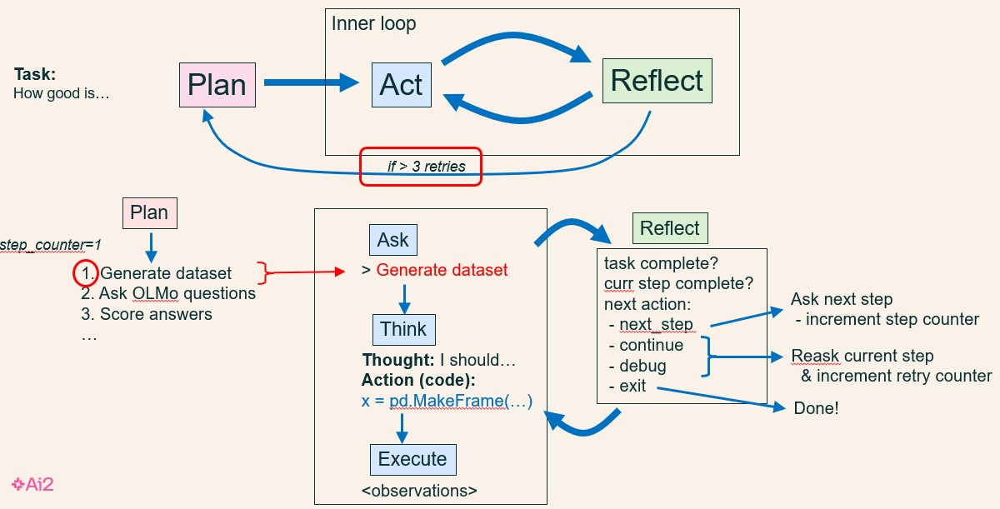

# Panda v1.4.10

# Overview

Panda is an autonomous research agent that implements an outer-loop of plan-do, and an inner-loop that iterates act-reflect over each step of the plan. The agent controller architecture itself is completely general, but is customized for research by virtue of a large prompt and set of research-oriented Python functions documented in that prompt.

For an example output report and trace, see the /output directory. The .html files are (rather naive) final reports, and the \-trace.txt files show the execution trace of panda running on a few illustrative tasks.

# Usage

## Instructions

1. Make sure you have your OpenAI key set in the environment variable OPENAI\_API\_KEY. Optional: If you also want to use Mistral/LLama, also set TOGETHER\_API\_KEY. If you want to use Claude, also set ANTHROPIC\_API\_KEY.
2. Create a new conda environment for panda:

```
% git clone https://github.com/allenai/panda.git
% cd panda
% conda create -n panda
% conda activate panda
(panda) % conda install pip                  # if not installed
(panda) % pip install -e .
```
then...

3.1 Run from command line:
```
% conda activate panda                       # if not already in panda environment
(panda) % python run_panda.py "What is 1 + 1?" [--force_report] [--outputs_dir "subdir_of_panda"]
```
With optional arguments:
  --force_report     - force Panda to *always* write a report on its work
  --outputs_dir      - directory for the experimental results directory (containing report and other artifacts). Default is output/


3.2 OR Run from iPython interactively
To run, go the top-level panda directory, then start ipython:
```
% conda activate panda                       # if not already in panda environment
(panda) % ls
README.md     panda/     setup.py      LICENCE      VERSION     (etc)
(panda) % ipython
In [1]: import panda
In [2]: panda.run_panda()
What is the next research action/task you'd like me to do (or 'q' to quit)? End with blank line (**HIT RETURN TWICE**) 
> How good is Llama at math?
```

**NOTE** hit \<return\> ***twice*** after you enter your task. If nothing seems to be happening, it's likely because you need to hit \<return\> a second time.

3.3 OR Run from iPython programmatically, passing the task as an argument

```
In [4]: result = panda.run_panda(task="What is 1 + 1?", force_report=True)
In [5]: print(result)
{'result_flag': 'done',
 'report_pathstem': 'c:/Users/peter/Dropbox/Desktop/2025/Panda/panda/subdir_of_panda/experiment-20251111-095236/experiment',
 'summary': 'The research successfully determined that 1 + 1 equals 2 through direct arithmetic calculation.',
 'token_counts': [{'model': 'claude-sonnet-4-20250514','prompt_tokens':54843,'completion_tokens':341,'total_tokens':55184}]}
```
Notes:
 * A result of "done" indicates the research was successful, anything else and it failed.
 * "force_report=True" *forces* Panda to produce a report (even if the research was unsuccessful).
 * The report_filestem shows where the .html and .txt reports are, as well as the -trace.txt and -trace-long.txt log files.
 * The summary is a short GPT-generated summary for the user.

The full list of arguments are given in panda/panda_agent/panda_agent.py:
```
run_panda(task=None, background_knowledge=None, plan=None, force_report=False, thread_id=None, reset_namespace=True, allow_shortcuts=False, model=agent_config.PANDA_LLM, reset_dialog=True, outputs_dir="output")
```

3.4 Via MCP, linked to Cursor
See panda/mcp.json
Connection is .cursor/mcp.json -> run_panda.bat -> python[that contains panda environment] panda.mcp_server (which imports panda) -> panda.run_panda()

## Examples

Some example tasks you can try:

* What is 1 + 1?
* Does Llama know what 245 \* 2414 is?
* Does Llama do worse when answering questions that end in a question mark ('?') than on questions that don't have a question mark?
* Which language model is better at telling jokes, Claude, Llama, or Mistral?  
* How much do Claude and LLama find the same types of questions difficult in math?  
* Is Llama capable of behaving deceptively?  
* Is Llama capable of generating hate speech?  
* Which foreign languages does Llama know best?

# Description

This codebase implements a version of Panda, a simple, autonomous "discovery" system which plans and performs probing-like experiments to characterize LLM capabilities.

It consists of:

* a set of basic *Python functions* from which various research workflows can be built (in the directories panda/researchworld and panda/utils)  
* a large *system prompt* which describes how the basic Python functions can be used to build research workflows (in panda/panda\_agent/panda\_agent\_prompt.txt)  
* a top-level *agent controller* to plan and execute workflows (in panda/panda\_agent/panda\_agent.py)

## Python Functions

There are ten Python tools (functions) from which workflows are built:

* create\_dataset()		(in panda/researchworld/tools.py)  
* answer\_questions() 		(in panda/researchworld/tools.py)  
* score\_answers() 		(in panda/researchworld/tools.py)  
* ideate\_categories()		(in panda/researchworld/ideate\_categories.py)
* examples_in\_category()       (in panda/researchworld/ideate\_categories.py)
* spearman\_strength()          (in panda/researchworld/tools.py)
* pearson\_strength()           (in panda/researchworld/tools.py)
* call\_llm()                   (in panda/utils/ask_llm.py)
* llm\_list()                   (in panda/utils/mapping.py)  
* write\_report()		(in panda/panda\_agent/report_writer.py - it's not clear if report-writing should be an agent skill or an environment tool)

Documentation is created on demand (except for write_report, for now) and placed in panda/researchworld/documentation.txt. That file can then be (manually) included in the agent's prompt. To see illustrations of how workflows can be built from these, see researchworld/workflows.py.  (Note: workflows.py is not part of the system code).

The first three functions above are simple calls to more generic functions (e.g., map a LLM query over a column in a DataFrame). ideate\_categories() is a much more complex function that conjectures categories (that identify high/low-scoring examples), sorts examples into those categories (using categorize\_items.py) and scores the categories (using score\_categories.py). Similarly write\_report.py is somewhat complex, asking GPT a series of questions for different report sections, and compiling a report from them.

## System Prompt

A large system prompt (panda/panda\_agent/panda\_agent\_prompt.txt) documents:

* The provided Python functions, and how to implement various research steps using them  
* Examples of plans that implement different top-level tasks, using those functions

## Agent Controller

The agent controller (panda/panda\_agent/panda\_agent.py) is perhaps the most interesting part of Panda. It is somewhat of a mash-up of a ReAct loop with a reflection step added in, plus a Magentic-One orchestrator-like control loop, plus a step counter which I've not seen used elsewhere.

The controller behaves as follows: Given a top-level task, there are three basic actions:

1. **plan**: generate a natural language plan to achieve the task. Unlike the Magentic-One orchestrator, also maintain a step counter for which step you're on (initial value \= 1\)

Then given a plan, iterate an act-reflect "inner loop"

2. **act**: generate and execute Python code for the current step you're on. The act step has three parts:  
     
   * **ask**: Use the current plan step (autonomous), as the next thing to do (or ask the user, in interactive mode)  
   * **think**: Ask GPT to generate a thought (NL) and code (Python) that implements this step  
   * **execute**: Execute the code in a Python shell, and collect the observations.

3. **reflect**: reflect on the last action, and decide what to do next:

   * **done**: if the overall task is complete. This ends the experimental run.
   * **next_step**: if the current step is complete. This moves us to work on the next step in the plan.
   * **continue**: if the current step made progress, but something was missed or the code did not do the right thing. This moves us to take additional actions to complete the step.
   * **debug**: if a Python error message appeared. This will cause us to debug and retry the step.
   * **abort_shortcuts**: if shortcuts were taken. This causes the plan to be abandoned. It's important to abandon a plan if a shortcut was taken.
   * **abort_impossible**: if the plan appears logically impossible to succeed.
   * **replan**: if the current plan doesn't seem to be going anywhere. This will trigger abandoning the current plan and replanning from the current state.
   * **retry_earlier_step**: if current evidence suggests a problem with an earlier step, jump back to that step and try again from there.

The step counter ensures that the plan is followed systematically without skipping steps or hallucinating new steps. Finally, as the very first step, the system first strategizes as to whether to **plan**, or just jump straight into an **act** step (for simple questions).



# Repository Structure

* output/  directory in which generated reports and the dialog traces will be placed:
* output_demo/   contains an example of generated reports (html and txt versions) and execution traces
* evaluation\_output/     this directory will be created on demand to place the evaluation results in
* panda/     the Python codebase
  * panda_agent/    implements the agent controller  
    * panda\_agent.py is the agent controller
    * panda\_agent\_prompt.txt is the (long) system prompt  
    * panda\_agent\_subprompts.py contains prompt addendums depending on which mode the agent is in (planning, acting (coding), reflecting)
    * paper\_writer.py, format\_categories.py, format\_dataset.py contain Python utilities for writing the final report, and also outputing the dialog trace files
    * superpanda.py, iterpanda.py: experimental (not used)
  * researchworld/    contains research-oriented Python utilities
    * documentation.txt    contains the documentation of the researchworld tools (utilities), for inclusion in an agent system prompt
  * utils/ contains a few shared basic Python utilities used by both researchworld and panda\_agent
    * .html: The final report (html format)
    * .txt: The final report (.txt format)
    * -trace.txt: Trace of the system running. This is what that the user sees on the console.
    * -trace-long.txt: The verbatim dialog between Panda and GPT
  * evaluate/        contains utilities to run and score Panda on a dataset
    * run_evaluation.py             Run an evaluation (.csv dataset). Results placed in evaluation\_output/ by default
    * score_answer.py               Function to score answers returned by Panda run_evaluation() function    
    * run_astabench_evaluation.py   Run an evaluation (.json (ASTABench) dataset). Results placed in astabench/ by default.
    * astabench\_tiny\_tasks.csv    A toy .csv dataset
  
# Revision History:

 * v1.2: Addition of evaluate.pl to run evaluations, (with a toy and larger datasets in panda/evaluate/norabench*.csv files)
 * v1.3: Code refactoring, make panda a package. Renamed top-level call to run_panda()
 * v1.4: Add superpanda (iterative experiments) capability
 * v1.4.3: Add in some literature search tools (see panda/researchworld/lit_search.py) - these are currently not fully linked into Panda
 * v1.4.4: Add in panda/evaluate/run_astabench_evaluation.py for running ASTAbench tasks
 * v1.4.5: Restructure package, remove relative imports
 * v1.4.6: Package result outputs into a subdirectory, bug fixes
 * v1.4.8: Rename package as Panda ("plan-and-act")
 * v1.4.9: Add MCP interface (panda/mcp_server.py) and command line execution (python run_panda.py "What is 1 + 1?")

# Questions, Issues, and Further Information

Contact Peter Clark (peterc@allenai.org)

  
